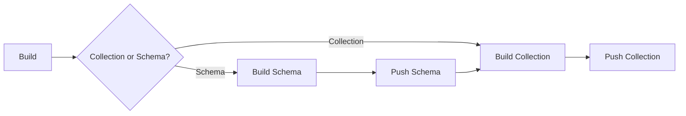
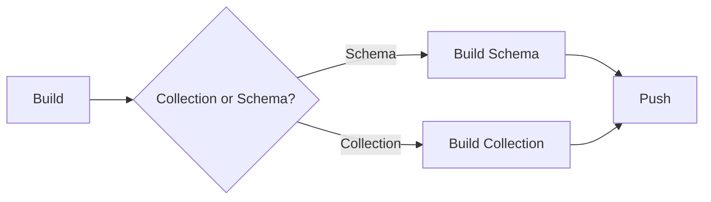

Design: Collection Workflow
===
- [Design: Collection Workflow](#design-collection-workflow)
- [Collection Publishing](#collection-publishing)
- [Collection Pulling](#collection-pulling)

# Collection Publishing

The workflow for collection publishing is very similar to the workflow used to build container images with most tooling options.
This is demonstrated below by the diagram.

This would be the workflow if the ultimate goal was to publish a collection with or without a schema. Schema can be published
without a subsequent collection publish for later use as well.

# Collection Pulling

Collections can be pulled as an entire OCI Artifact or filtered by an Attribute Query. The filtered OCI artifact is stored
in the build cache with the original manifest intact (sparse manifest) and the non-matching blobs (files) are not pulled into the cache.
All matching files are written to the cache and written to a user specified location.

The use of sparse manifest can pose a problem if re-tagging collections becomes part of the command line functionality in the future.
Some registries will reject manifests without all the blobs present. In this case, it may be of interest to reconstruct the manifest before pushing
and allow a flag to preserve the manifest, if desired.

