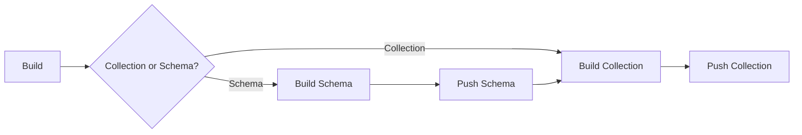
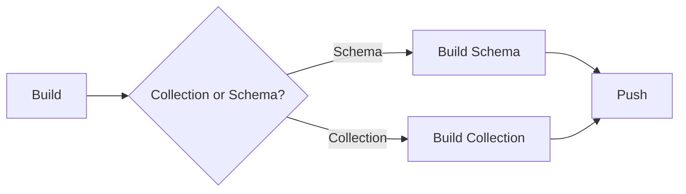

# Collections

- [Collections](#collections)
  - [Overview](#overview)
  - [Collection Publishing](#collection-publishing)
  - [Collection Pulling](#collection-pulling)
  - [Collection Manager](#collection-manager)
  - [Collections and Schemas](#collections-and-schemas)
    - [Schema Elements](#schema-elements)
      - [Attribute Type Declarations](#attribute-type-declarations)
      - [Algorithm Reference](#algorithm-reference)
      - [Common Attribute Mappings](#common-attribute-mappings)
      - [Default Content Declaration](#default-content-declaration)
    - [Design](#design)
  - [Why not use the Manifest Referrers API?](#why-not-use-the-manifest-referrers-api)

## Overview

Collections are a type of artifact that contain additional metadata that used linked artifacts to build larger applications and linked application dependencies.
The additional metadata is stored in the manifest annotation of the collection and contain a reference to a schema also published as an artifact. The schema usage is explored in more detail below.

## Collection Publishing

The workflow for collection publishing is very similar to the workflow used to build container images with most tooling options.
If the schema is published before the collection and associated to the collection, the specified attributes in the dataset configuration
will be validated against the schema during collection building.
This is demonstrated below by the diagram.

This would be the workflow if the ultimate goal was to publish a collection with or without a schema. Schema can be published
without a subsequent collection publish for later use as well.

## Collection Pulling

Collections can be pulled as an entire OCI Artifact or filtered by an Attribute Query. The filtered OCI artifact is stored
in the build cache with the original manifest intact (sparse manifest) and the non-matching blobs (files) are not pulled into the cache.
All matching files are written to the cache and written to a user specified location.

The use of sparse manifest can pose a problem if re-tagging collections becomes part of the command line functionality in the future.
Some registries will reject manifests without all the blobs present. In this case, it may be of interest to reconstruct the manifest before pushing
and allow a flag to preserve the manifest, if desired.

## Collection Manager

Collection publishing and pulling can be accomplished over gRPC with the `serve` command. 
The client acts as a gRPC server that will retrieve and publish collections upon client request. 
A top-level type called `Manager` is used to provide this functionality to the CLI and gRPC server. There is a default implementation located 
in the `manager` package that is currently used.

The gRPC server is reading and writing in locations relative to its instantiated location. Due to this, a unix domain socket is used for client/server communication. gRPC client
must provide absolute pathing for expected results.

## Collections and Schemas

Emporous Schema is the attribute type declaration for an Emporous Collection. Schema also links application logic to importing Emporous Collection. Schema can also be used for like validating a Collection's links and attribute declarations. It can also be used to logically group Collections together.

This document explains Emporous Schema and the relationship of an Emporous Collection with its imported Schema. 

### Schema Elements

There are four elements within a schema:

1. Attribute Type Declarations
2. Algorithm Reference
3. Common Attribute Mappings
4. Default Content Reference

#### Attribute Type Declarations

Attribute type declarations MUST reside within a manifest of the Schema Collection a JSON Schema document. Attribute type
declarations MUST follow the following syntax and guidelines:

**Values** - Attribute type declarations are expression via manifest annotation. The key,value pairs are stored 
as an annotation value in a JSON dictionary.

1. Number (expressed at float)
2. Integer
3. String
4. Boolean
5. Null

#### Algorithm Reference

Schemas Collections MAY contain Algorithm References. A Collection's Algorithm Reference can be thought of as the "
application logic" of the Collection. The Algorithm Reference in a Schema Collection is the link to the algorithm
imported into a calling Collection. This reference is expressed by assigning the `emporous.algorithm=true` attribute to the
node annotations of the Algorithm's Linked Collection.

#### Common Attribute Mappings

Schema Collections MAY contain Common Attribute Mappings. The Common Attribute Mappings in a schema instruct the emporous
Client to add preset attributes to a Collection while being built. This reference is expressed by assigning
the `emporous.attribute` key to a value with a JSON serialized dictionary with mapping information.

#### Default Content Declaration

Schema Collections MAY contain a Default Content Declaration. The Default Content Declaration in a schema is referenced by an algorithm linked to a collection when the algorithm is run.
This Declaration is stored in the manifest configuration of the Schema Collection.  

### Design

Collections import Schema via an annotated Linked Collection. A Schema Collection imports an Algorithm into the Schema's calling collection. A Collection can only have one Schema and a Schema can have only one Algorithm Reference.  

When the Emporous Client retrieves a Collection, it first retrieves the OCI manifest of the referenced collection. The Emporous Client then searches the manifest for a reference to an imported schema. If a schema is found, the emporous client retrieves the OCI Manifest of the imported schema. The emporous Client then searches the Schema Collection's OCI Manifest for an Algorithm Reference. If an Algorithm Reference is found, The emporous Client will first check its cache and if needed, download the Referenced Algorithm for further operations.

A Collection can only import a single schema. However, a Collection may link to another collection with a different schema. There are two types of schema declarations in a Collection's OCI Manifest. Those are: `emporous.schema={{ Schema Collection address (Full URI or just the digest of the referenced Schema Collection's OCI manifest) }}` and `emporous.schema.linked={{ The digest of all Schema Collection OCI Manifest References inherited through Collection links}}`. When a collection links to another collection, all linked schemas of the Referenced Linked Collection are inherited by the linking Collection and written to the value of the `Emporous.schema.linked` attribute.

## Why not use the Manifest Referrers API?
[Info here](https://github.com/oras-project/artifacts-spec/blob/main/manifest-referrers-api.md)

Collections can refer to other collections, but this linkage does not fit into the scope of the referrers API because these
references must be mutable. Collections can be linked with existing collections, but there is not a one-to-many relationship
between collections. Collection linkage can also be cross-repository and currently the Manifest Referrers API is scoped to a repository.